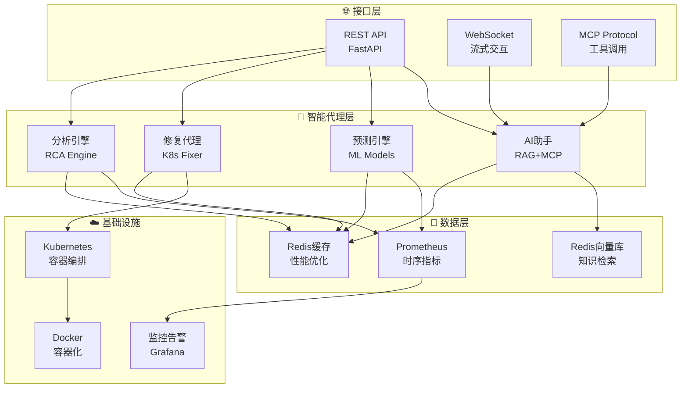

<div align="center">

# 🚀 AI-CloudOps 智能云原生运维平台

*下一代 AI 驱动的智能运维解决方案*

[](https://www.python.org/downloads/)
[](https://fastapi.tiangolo.com/)
[](https://kubernetes.io/)
[](https://opensource.org/licenses/MIT)
[](https://www.docker.com/)

[🎯 核心特性](#-核心特性) • [🏗️ 架构设计](#%EF%B8%8F-架构设计) • [⚡ 快速开始](#-快速开始) • [📚 文档](#-api-文档) • [🤝 贡献](#-贡献指南)

---

**AI-CloudOps** 是业界领先的智能云原生运维平台，融合了 **人工智能**、**机器学习** 和 **自动化运维** 技术，为现代化基础设施提供全方位的智能运维解决方案。

</div>

## ✨ 为什么选择 AI-CloudOps？

<table>
<tr>
<td width="50%">

### 🎯 **核心价值**
- 🔥 **90%+ 故障自动诊断准确率**
- ⚡ **秒级问题根因定位**
- 🛡️ **7×24 智能监控预警**
- 💰 **平均降低 40% 运维成本**
- 🚀 **零停机智能扩缩容**

</td>
<td width="50%">

### 💫 **技术优势**
- 🧠 **大语言模型 + 专家知识库**
- 🔍 **多数据源融合分析**
- 🛠️ **自动化修复引擎**
- 📊 **实时智能预测**
- 🔗 **云原生深度集成**

</td>
</tr>
</table>

---

## 🎯 核心特性

<div align="center">

### 🤖 **智能助手** | 🔮 **预测分析** | 🛠️ **自动修复** | 📊 **根因分析** | 💡 **健康监控**

</div>

### 🤖 **双模式 AI 助手**
> **RAG + MCP 混合架构，专为运维场景优化**

- 🧠 **RAG 模式**: 基于向量检索的知识问答，涵盖数万条运维最佳实践
- 🔧 **MCP 模式**: 直接调用 Kubernetes API，实时操作集群资源  
- 💬 **智能对话**: 支持上下文理解，多轮对话解决复杂问题
- 🎯 **意图识别**: 自动路由到最适合的处理模式

### 🔮 **智能负载预测**
> **机器学习驱动的容量规划**

- 📈 **多维预测**: QPS、CPU、内存、磁盘使用趋势预测
- ⏰ **时间窗口**: 支持 1-168 小时的预测时间跨度
- 🎯 **精准建议**: 智能实例数量和资源配置推荐
- 📊 **置信度评估**: 提供预测可信度和风险评估

### 🛠️ **K8s 自动修复**
> **零人工干预的故障自愈**

- 🔍 **智能诊断**: 深度分析 Pod、Deployment、Service 状态
- 🚀 **自动修复**: 智能重启、扩缩容、配置调整
- 🛡️ **风险控制**: 修复前预检、安全限制、回滚机制
- 📋 **操作记录**: 完整的修复日志和影响评估

### 📊 **AI 根因分析**
> **多数据源融合的故障诊断引擎**

- 🔍 **数据融合**: 整合 Prometheus 指标、K8s 事件、Pod 日志
- 🧮 **异常检测**: 基于统计学和机器学习的异常识别
- 🔗 **关联分析**: 多维度相关性分析和因果推理
- ⚡ **快速定位**: 平均 30 秒内完成根因分析

### 💡 **全栈健康监控**
> **端到端的系统状态感知**

- 🌐 **多组件监控**: LLM 服务、向量存储、K8s 集群、缓存系统
- 💓 **健康检查**: 启动探针、存活探针、就绪探针
- 📊 **性能指标**: 响应时间、可用性、错误率实时监控
- 🚨 **智能告警**: 基于阈值和趋势的多级告警策略

---

## 🏗️ 架构设计

<div align="center">



</div>

### 🔥 技术栈亮点

<table>
<tr>
<td align="center"><strong>🚀 后端框架</strong><br/>FastAPI + AsyncIO</td>
<td align="center"><strong>🧠 AI 引擎</strong><br/>LangGraph + OpenAI</td>
<td align="center"><strong>💾 数据存储</strong><br/>Redis + Prometheus</td>
<td align="center"><strong>☁️ 容器化</strong><br/>Docker + K8s</td>
</tr>
</table>

---

## ⚡ 快速开始

### 🎯 **一键部署（推荐）**

```bash
# 1️⃣ 克隆项目
git clone https://github.com/GoSimplicity/AI-CloudOps.git
cd AI-CloudOps

# 2️⃣ 配置环境
cp env.example .env
nano .env  # 配置 LLM_API_KEY 等必要参数

# 3️⃣ 一键启动
chmod +x scripts/deploy.sh
./scripts/deploy.sh
```

### ⚙️ **核心配置**

```bash
# 🔑 必需配置
LLM_API_KEY=sk-your-api-key              # LLM API 密钥
LLM_BASE_URL=https://api.openai.com/v1   # LLM API 地址
LLM_MODEL=gpt-4o-mini                    # 使用的模型

# 🔧 可选配置  
K8S_CONFIG_PATH=~/.kube/config           # Kubernetes 配置
REDIS_PASSWORD=your-secure-password      # Redis 密码
PROMETHEUS_URL=http://localhost:9090     # Prometheus 地址
```

### 🎉 **验证部署**

部署完成后，访问以下地址验证服务状态：

<div align="center">

| 🌐 **服务** | 📍 **地址** | 📝 **说明** |
|:---:|:---:|:---:|
| 🚀 **主应用** | http://localhost:8080 | API 服务和文档 |
| 🔧 **MCP 服务** | http://localhost:9000 | 工具调用服务 |
| 📊 **监控面板** | http://localhost:9090 | Prometheus 监控 |

</div>

```bash
# ✅ 健康检查
curl http://localhost:8080/api/v1/health

# 📚 API 文档
open http://localhost:8080/docs
```

---

## 🎨 功能演示

### 💬 **智能助手对话示例**

<details>
<summary>🤖 <strong>点击查看 AI 助手交互演示</strong></summary>

```json
// 💡 RAG 模式 - 知识问答
POST /api/v1/assistant/query
{
  "question": "Kubernetes Pod 一直处于 Pending 状态怎么办？",
  "mode": "rag",
  "session_id": "user123"
}

// 📖 响应示例
{
  "code": 0,
  "message": "查询成功",
  "data": {
    "answer": "Pod 处于 Pending 状态通常有以下几个原因和解决方案：\n\n🔍 **常见原因分析**：\n1. **资源不足** - 集群没有足够的 CPU/内存资源\n2. **调度约束** - nodeSelector、affinity 规则限制\n3. **存储问题** - PVC 无法绑定到 PV\n4. **镜像拉取** - 镜像不存在或权限问题\n\n🛠️ **排查步骤**：\n```bash\n# 查看 Pod 详细信息\nkubectl describe pod <pod-name>\n\n# 查看集群资源状态\nkubectl top nodes\nkubectl get pv,pvc\n```",
    "sources": [
      {
        "title": "Kubernetes Pod 故障排查指南",
        "relevance_score": 0.95
      }
    ],
    "processing_time": 1.2
  }
}
```

```json
// 🔧 MCP 模式 - 工具调用
POST /api/v1/assistant/query
{
  "question": "帮我查看 default 命名空间下的 Pod 状态",
  "mode": "mcp",
  "session_id": "user123"
}

// 🚀 响应示例
{
  "data": {
    "answer": "✅ **已成功获取 Pod 状态**\n\n📊 **运行状态统计**:\n- 🟢 Running: 5 个\n- 🟡 Pending: 1 个  \n- 🔴 Failed: 0 个\n\n📝 **详细信息**:\n1. **nginx-deployment-xxx** (Running) - CPU: 0.1/0.5, Memory: 128Mi/512Mi\n2. **redis-master-yyy** (Running) - CPU: 0.2/1.0, Memory: 256Mi/1Gi\n3. **worker-job-zzz** (Pending) - 等待调度...",
    "tool_calls": [
      {
        "tool_name": "k8s_pod_tool",
        "execution_time": 0.3,
        "status": "success"
      }
    ]
  }
}
```

</details>

### 📊 **负载预测分析示例**

<details>
<summary>🔮 <strong>点击查看智能预测功能演示</strong></summary>

```json
// 📈 负载预测请求
POST /api/v1/predict/qps
{
  "service_name": "web-service",
  "current_qps": 500.0,
  "hours": 24,
  "instance_cpu": 2.0,
  "instance_memory": 4.0
}

// 📊 预测结果
{
  "data": {
    "predictions": [
      {
        "hour": 1,
        "predicted_qps": 520.5,
        "confidence_score": 0.95,
        "peak_probability": 0.12
      },
      {
        "hour": 8,
        "predicted_qps": 890.2,
        "confidence_score": 0.88,
        "peak_probability": 0.85
      }
    ],
    "recommendations": {
      "suggested_instances": 6,
      "scale_up_time": "2024-01-01T07:30:00Z",
      "cpu_recommendation": 2.5,
      "memory_recommendation": 5.0
    },
    "analysis": {
      "max_predicted_qps": 1250.8,
      "growth_rate": 1.51,
      "volatility": "中等"
    }
  }
}
```

</details>

### 🔍 **根因分析报告示例**

<details>
<summary>🕵️ <strong>点击查看故障根因分析演示</strong></summary>

```json
// 🔍 根因分析请求
POST /api/v1/rca/analyze
{
  "namespace": "production",
  "time_window_hours": 1.0,
  "severity_threshold": 0.7
}

// 📋 分析报告
{
  "data": {
    "root_causes": [
      {
        "cause_type": "resource_exhaustion",
        "title": "🔥 CPU 使用率异常飙升",
        "confidence_score": 0.92,
        "severity": "high",
        "affected_resources": [
          {"type": "pod", "name": "web-app-xxx", "namespace": "production"}
        ],
        "recommendations": [
          {
            "action": "scale_up",
            "description": "建议将副本数从 3 增加到 6",
            "priority": "high",
            "estimated_impact": "可解决当前性能瓶颈"
          }
        ],
        "supporting_evidence": [
          {
            "type": "metric",
            "description": "CPU 使用率峰值达到 98%",
            "timestamp": "2024-01-01T10:15:00Z"
          }
        ]
      }
    ],
    "summary": {
      "total_issues": 2,
      "high_priority": 1,
      "analysis_duration": 2.3
    }
  }
}
```

</details>

---

## 📚 API 文档

### 🚀 **核心 API 端点**

<div align="center">

| 🎯 **模块** | 📍 **端点** | 📝 **功能** |
|:---:|:---:|:---:|
| 🤖 **智能助手** | `POST /api/v1/assistant/query` | RAG/MCP 双模式问答 |
| 🔮 **预测分析** | `POST /api/v1/predict/qps` | QPS 负载预测 |
| 🔍 **根因分析** | `POST /api/v1/rca/analyze` | 综合故障诊断 |
| 🛠️ **自动修复** | `POST /api/v1/autofix/fix` | K8s 资源自动修复 |
| 💡 **健康检查** | `GET /api/v1/health` | 系统健康状态 |

</div>

### 📖 **详细文档**

- 📱 **交互式 API 文档**: http://localhost:8080/docs
- 📋 **OpenAPI 规范**: http://localhost:8080/openapi.json
- 🔧 **MCP 工具文档**: [app/mcp/README.md](app/mcp/README.md)

---

## 📦 系统要求

### 🖥️ **最低配置**
- **OS**: Linux/macOS/Windows
- **RAM**: 8GB+ (推荐 16GB+)
- **CPU**: 4 核心+
- **存储**: 20GB+ 可用空间

### 🛠️ **软件依赖**
- **Python**: 3.11+
- **Docker**: 20.10+
- **Docker Compose**: 2.0+
- **Redis**: 7.0+
- **Kubernetes**: 1.20+ (可选)

---

## 🔧 高级配置

### 🎯 **生产环境优化**

```yaml
# docker-compose.production.yml 资源限制
services:
  aiops-platform:
    deploy:
      resources:
        limits:
          memory: 8G
          cpus: '4.0'
        reservations:
          memory: 4G
          cpus: '2.0'
    environment:
      - ENV=production
      - LOG_LEVEL=INFO
      - REDIS_MAX_CONNECTIONS=50
```

### 📊 **监控配置**

```yaml
# Prometheus 配置
scrape_configs:
  - job_name: 'aiops-platform'
    static_configs:
      - targets: ['aiops-platform:8080']
    scrape_interval: 15s
    metrics_path: '/metrics'
```

### 🔒 **安全配置**

```bash
# 生产环境安全设置
REDIS_PASSWORD=your-secure-password
API_RATE_LIMIT=1000
CORS_ORIGINS=https://your-domain.com
JWT_SECRET_KEY=your-jwt-secret
```

---

## 🚧 路线图

### 🎯 **v2.1.0 (计划中)**
- [ ] 🎨 Web UI 管理面板
- [ ] 📊 Grafana 仪表板集成
- [ ] 🔔 多渠道告警通知
- [ ] 🌐 多云平台支持

### 🚀 **v2.2.0 (规划中)**
- [ ] 🤝 团队协作功能
- [ ] 📈 成本分析与优化
- [ ] 🛡️ 安全扫描集成
- [ ] 🔄 GitOps 工作流

---

## 🤝 贡献指南

我们欢迎任何形式的贡献！🎉

### 🌟 **快速贡献**

```bash
# 1️⃣ Fork 项目
git clone https://github.com/your-username/AI-CloudOps.git

# 2️⃣ 创建特性分支
git checkout -b feature/amazing-feature

# 3️⃣ 提交更改
git commit -m 'Add amazing feature'

# 4️⃣ 推送分支
git push origin feature/amazing-feature

# 5️⃣ 创建 Pull Request
```

### 🎯 **贡献类型**
- 🐛 **Bug 修复**
- ✨ **新功能开发**
- 📝 **文档改进**
- 🔧 **性能优化**
- 🧪 **测试用例**

---

## 💬 社区支持

<div align="center">

### 获取帮助的最佳方式

[](https://github.com/GoSimplicity/AI-CloudOps/issues)
[](mailto:bamboocloudops@gmail.com)
[](./docs/)

</div>

### 📞 **联系方式**
- 🏠 **项目主页**: https://github.com/GoSimplicity/AI-CloudOps
- 📧 **邮件支持**: bamboocloudops@gmail.com
- 🐛 **问题报告**: https://github.com/GoSimplicity/AI-CloudOps/issues
- 💡 **功能建议**: https://github.com/GoSimplicity/AI-CloudOps/discussions

---

## 📜 许可证

本项目基于 [MIT 许可证](LICENSE) 开源。

---

<div align="center">

### 🌟 **如果这个项目对你有帮助，请给我们一个 Star！** ⭐

**Made with ❤️ by the AI-CloudOps Team**

*让 AI 为云原生运维赋能* 🚀

---

**最后更新**: 2025-09-13 | **版本**: v2.0.0

</div>
