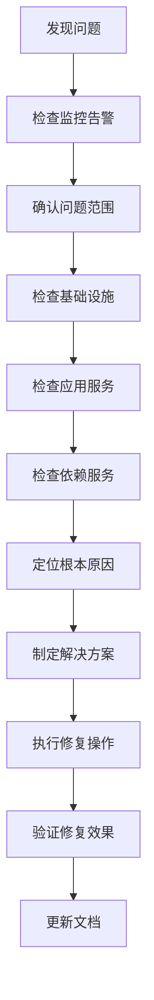

# AI-CloudOps 监控与故障排查手册

## 监控体系概述

AI-CloudOps平台采用多层次的监控体系，涵盖基础设施、应用服务、业务指标和用户体验等多个维度，实现全方位的系统可观测性。

## 监控架构

### 监控组件
- **Prometheus**：指标收集和存储
- **Grafana**：可视化展示和告警
- **AlertManager**：告警管理和通知
- **Jaeger**：分布式链路追踪
- **ELK Stack**：日志收集和分析

### 数据流向
```
应用服务 → Prometheus → Grafana/AlertManager
     ↓
  日志系统 → Logstash → Elasticsearch → Kibana
     ↓
  链路追踪 → Jaeger Collector → Jaeger Query
```

## 核心监控指标

### 1. 基础设施监控

#### 服务器资源指标
```yaml
# CPU相关指标
- cpu_usage_percent          # CPU使用率
- cpu_load_average          # 负载平均值
- cpu_context_switches      # 上下文切换次数

# 内存相关指标
- memory_usage_percent      # 内存使用率
- memory_available_bytes    # 可用内存
- memory_swap_usage         # Swap使用情况

# 磁盘相关指标
- disk_usage_percent        # 磁盘使用率
- disk_io_read_bytes        # 磁盘读取字节数
- disk_io_write_bytes       # 磁盘写入字节数

# 网络相关指标
- network_receive_bytes     # 网络接收字节数
- network_transmit_bytes    # 网络发送字节数
- network_connections       # 网络连接数
```

#### Kubernetes集群指标
```yaml
# 节点指标
- kube_node_status          # 节点状态
- kube_node_memory_usage    # 节点内存使用
- kube_node_cpu_usage       # 节点CPU使用

# Pod指标
- kube_pod_status           # Pod状态
- kube_pod_container_restarts # 容器重启次数
- kube_pod_memory_usage     # Pod内存使用
- kube_pod_cpu_usage        # Pod CPU使用

# 服务指标
- kube_service_endpoints    # 服务端点数量
- kube_ingress_status       # Ingress状态
```

### 2. 应用服务监控

#### API服务指标
```yaml
# 请求指标
- http_requests_total       # 总请求数
- http_request_duration     # 请求响应时间
- http_requests_rate        # 请求频率

# 错误指标
- http_errors_total         # 错误总数
- http_error_rate           # 错误率
- http_status_codes         # HTTP状态码分布

# 性能指标
- api_response_time_p95     # 95分位响应时间
- api_response_time_p99     # 99分位响应时间
- api_throughput            # API吞吐量
```

#### AI服务指标
```yaml
# 模型指标
- ai_model_inference_time   # 模型推理时间
- ai_model_requests_total   # 模型请求总数
- ai_model_errors_total     # 模型错误总数

# 向量检索指标
- vector_search_latency     # 向量检索延迟
- vector_search_accuracy    # 检索准确率
- knowledge_base_size       # 知识库大小

# RAG指标
- rag_query_processing_time # RAG查询处理时间
- rag_context_relevance     # 上下文相关性
- rag_answer_quality        # 答案质量评分
```

### 3. 业务指标监控

#### 用户行为指标
```yaml
# 使用指标
- user_sessions_total       # 用户会话总数
- user_active_sessions      # 活跃会话数
- user_queries_per_session  # 每会话查询数

# 满意度指标
- user_feedback_positive    # 正面反馈率
- user_feedback_negative    # 负面反馈率
- query_success_rate        # 查询成功率
```

#### 系统健康指标
```yaml
# 可用性指标
- system_uptime             # 系统运行时间
- service_availability      # 服务可用性
- health_check_status       # 健康检查状态

# 性能指标
- system_performance_score  # 系统性能评分
- resource_efficiency       # 资源利用效率
- cost_optimization_ratio   # 成本优化比例
```

## 监控配置

### 1. Prometheus配置

#### prometheus.yml
```yaml
global:
  scrape_interval: 15s
  evaluation_interval: 15s

rule_files:
  - "alert_rules.yml"

alerting:
  alertmanagers:
    - static_configs:
        - targets:
          - alertmanager:9093

scrape_configs:
  # AI-CloudOps API服务
  - job_name: 'aiops-api'
    static_configs:
      - targets: ['aiops-api:8000']
    metrics_path: '/metrics'
    scrape_interval: 10s

  # Redis监控
  - job_name: 'redis'
    static_configs:
      - targets: ['redis:6379']
    scrape_interval: 10s

  # 节点监控
  - job_name: 'node-exporter'
    static_configs:
      - targets: ['node-exporter:9100']

  # Kubernetes监控
  - job_name: 'kube-state-metrics'
    static_configs:
      - targets: ['kube-state-metrics:8080']
```

#### 告警规则配置
```yaml
# alert_rules.yml
groups:
- name: aiops.rules
  rules:
  # 高错误率告警
  - alert: HighErrorRate
    expr: rate(http_errors_total[5m]) > 0.1
    for: 2m
    labels:
      severity: warning
    annotations:
      summary: "高错误率检测"
      description: "API错误率超过10%，当前值: {{ $value }}"

  # 高响应时间告警
  - alert: HighResponseTime
    expr: histogram_quantile(0.95, rate(http_request_duration_seconds_bucket[5m])) > 2
    for: 1m
    labels:
      severity: critical
    annotations:
      summary: "响应时间过长"
      description: "95分位响应时间超过2秒"

  # 内存使用率告警
  - alert: HighMemoryUsage
    expr: memory_usage_percent > 80
    for: 5m
    labels:
      severity: warning
    annotations:
      summary: "内存使用率过高"
      description: "内存使用率超过80%"

  # AI模型不可用告警
  - alert: AIModelUnavailable
    expr: up{job="aiops-api"} == 0
    for: 1m
    labels:
      severity: critical
    annotations:
      summary: "AI模型服务不可用"
      description: "AI模型服务已下线"

  # 知识库更新失败告警
  - alert: KnowledgeBaseUpdateFailed
    expr: increase(knowledge_base_update_failures_total[30m]) > 0
    for: 0m
    labels:
      severity: warning
    annotations:
      summary: "知识库更新失败"
      description: "知识库在过去30分钟内更新失败"
```

### 2. Grafana仪表盘配置

#### 主要仪表盘
```json
{
  "dashboard": {
    "title": "AI-CloudOps 系统监控",
    "panels": [
      {
        "title": "API请求量",
        "type": "graph",
        "targets": [
          {
            "expr": "rate(http_requests_total[5m])",
            "legendFormat": "{{method}} {{endpoint}}"
          }
        ]
      },
      {
        "title": "响应时间分布",
        "type": "graph",
        "targets": [
          {
            "expr": "histogram_quantile(0.50, rate(http_request_duration_seconds_bucket[5m]))",
            "legendFormat": "50th percentile"
          },
          {
            "expr": "histogram_quantile(0.95, rate(http_request_duration_seconds_bucket[5m]))",
            "legendFormat": "95th percentile"
          }
        ]
      },
      {
        "title": "错误率",
        "type": "singlestat",
        "targets": [
          {
            "expr": "rate(http_errors_total[5m]) / rate(http_requests_total[5m]) * 100",
            "legendFormat": "Error Rate %"
          }
        ]
      }
    ]
  }
}
```

## 故障排查指南

### 1. 常见故障类型

#### 性能问题
```bash
# 问题特征
- 响应时间过长（>2秒）
- 吞吐量下降
- 资源使用率过高

# 排查步骤
1. 检查系统资源使用情况
   top -p $(pgrep -f "python.*aiops")
   
2. 检查数据库连接状态
   redis-cli info clients
   
3. 分析慢查询日志
   grep "slow" /var/log/aiops/app.log
   
4. 检查AI模型响应时间
   curl -w "@curl-format.txt" -o /dev/null http://localhost:8000/api/v1/assistant/query
```

#### 可用性问题
```bash
# 问题特征
- 服务无法访问
- 健康检查失败
- 大量错误日志

# 排查步骤
1. 检查服务状态
   systemctl status aiops-api
   docker ps | grep aiops
   
2. 检查端口监听
   netstat -tlnp | grep 8000
   
3. 检查依赖服务
   redis-cli ping
   curl http://localhost:11434/api/tags  # Ollama
   
4. 查看错误日志
   tail -f /var/log/aiops/app.log
   journalctl -u aiops-api -f
```

#### AI功能问题
```bash
# 问题特征
- AI回答质量下降
- 向量检索失败
- 知识库更新错误

# 排查步骤
1. 检查AI模型连接
   curl -H "Authorization: Bearer $OPENAI_API_KEY" \
     https://api.openai.com/v1/models
   
2. 检查向量数据库状态
   redis-cli INFO memory
   redis-cli KEYS "vector:*" | wc -l
   
3. 验证知识库文档
   ls -la data/knowledge_base/
   
4. 测试向量检索功能
   curl -X POST http://localhost:8000/api/v1/assistant/query \
     -d '{"question":"测试问题"}'
```

### 2. 故障排查流程

#### 系统层面排查


#### 应用层面排查
```bash
#!/bin/bash
# 应用故障排查脚本

echo "=== AI-CloudOps 故障排查 ==="

# 1. 检查服务状态
echo "1. 检查服务状态..."
curl -s http://localhost:8000/health | jq '.'

# 2. 检查资源使用
echo "2. 检查资源使用..."
ps aux | grep -E "(python|redis)" | head -10

# 3. 检查错误日志
echo "3. 检查错误日志..."
tail -20 /var/log/aiops/app.log | grep -i error

# 4. 检查Redis连接
echo "4. 检查Redis连接..."
redis-cli ping

# 5. 测试AI功能
echo "5. 测试AI功能..."
curl -X POST http://localhost:8000/api/v1/assistant/query \
  -H "Content-Type: application/json" \
  -d '{"question":"系统状态如何？"}' | jq '.code'

echo "=== 排查完成 ==="
```

### 3. 常见问题解决方案

#### 内存溢出问题
```bash
# 问题：应用内存使用过高
# 解决方案：

# 1. 查看内存使用详情
ps -eo pid,ppid,cmd,%mem,%cpu --sort=-%mem | head

# 2. 调整JVM/Python内存限制
export PYTHONMAXMEMORY=4G

# 3. 清理缓存
curl -X POST http://localhost:8000/api/v1/assistant/clear-cache

# 4. 重启服务
systemctl restart aiops-api

# 5. 配置内存监控
echo "vm.swappiness=10" >> /etc/sysctl.conf
```

#### Redis连接池耗尽
```bash
# 问题：Redis连接池耗尽
# 解决方案：

# 1. 检查连接数
redis-cli info clients

# 2. 查看连接池配置
grep -A 5 "redis:" config/config.yaml

# 3. 调整连接池大小
sed -i 's/max_connections: 10/max_connections: 50/' config/config.yaml

# 4. 重启应用
docker-compose restart aiops-api
```

#### AI模型访问超时
```bash
# 问题：AI模型响应超时
# 解决方案：

# 1. 检查网络连接
ping -c 3 api.openai.com

# 2. 测试API连通性
curl -I https://api.openai.com/v1/models

# 3. 调整超时配置
sed -i 's/timeout: 30/timeout: 60/' config/config.yaml

# 4. 启用重试机制
sed -i 's/max_retries: 3/max_retries: 5/' config/config.yaml
```

#### 知识库检索精度低
```bash
# 问题：知识库检索精度不高
# 解决方案：

# 1. 重新生成向量索引
curl -X POST http://localhost:8000/api/v1/assistant/refresh

# 2. 调整检索参数
# 编辑config/config.yaml中的相似度阈值

# 3. 优化文档分割
# 调整chunk_size和chunk_overlap参数

# 4. 更新嵌入模型
# 使用更新的embedding模型
```

## 性能优化建议

### 1. 监控优化
- 设置合理的监控频率（避免过于频繁）
- 配置分层告警（warning/critical）
- 使用异步监控减少性能影响
- 定期清理历史监控数据

### 2. 告警优化
- 避免告警风暴（配置抑制规则）
- 设置合理的告警阈值
- 建立告警升级机制
- 配置智能告警聚合

### 3. 日志优化
- 使用结构化日志格式
- 配置日志轮转和压缩
- 分离不同级别的日志
- 建立日志采样机制

## 最佳实践

### 1. 监控策略
- **全栈监控**：覆盖所有技术栈层次
- **业务监控**：关注业务关键指标
- **预测性监控**：提前发现潜在问题
- **智能监控**：使用AI辅助异常检测

### 2. 故障处理
- **快速响应**：建立快速响应机制
- **根因分析**：深入分析问题根本原因
- **预防措施**：制定预防类似问题的措施
- **知识积累**：建立故障处理知识库

### 3. 运维自动化
- **自动化修复**：常见问题自动修复
- **智能告警**：减少误报和漏报
- **性能调优**：自动性能优化
- **容量规划**：智能容量预测和规划

---

*本手册会根据系统演进持续更新，建议定期查看最新版本。*